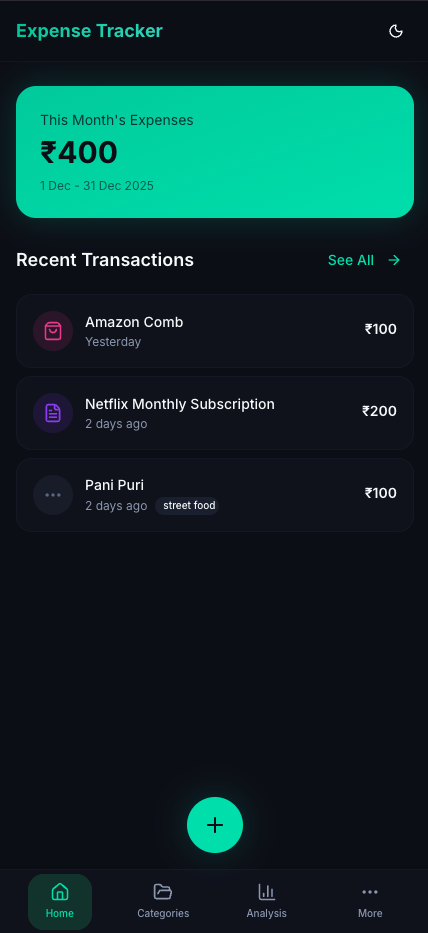
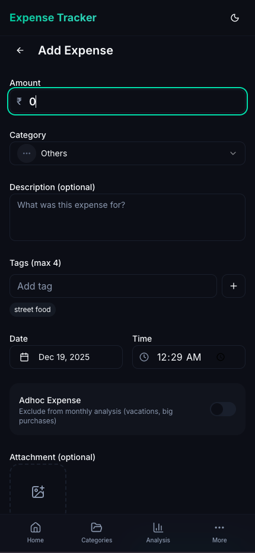
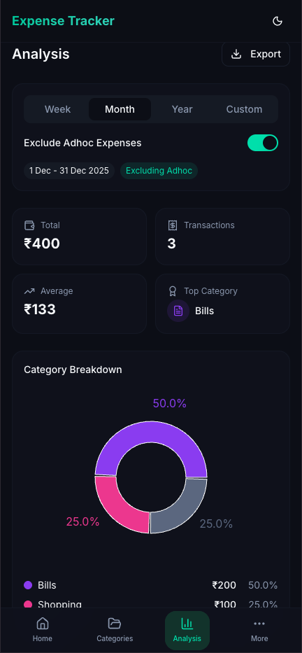

# 🚀 ExTrack - Expense Tracker PWA

[](https://extrack.madhukm.com)
[](LICENSE)
[](https://vitejs.dev/)
[](https://react.dev/)
[](https://dexie.org/)
[](https://tailwindcss.com/)
[](https://web.dev/progressive-web-apps/)

---

## 🎉 Welcome!

**ExTrack** is a privacy-first, offline-friendly, installable PWA for tracking and analyzing your personal expenses. No accounts, no backend, just pure fun and financial freedom! 🌈💸

<!-- 🎥 GIF: Hero overview : 15–20s tour: home page with expense list, tap Add, fill the form, see the dashboard update, swipe to Analysis showing pie + trend charts -->

📖 **[View Full Project Showcase](docs/gtm/project-showcase.md)**

---

## 📦 Features

- **Offline-first**: All data stored locally in your browser (IndexedDB via Dexie.js)
- **Mobile & Desktop**: Responsive, touch-friendly UI
- **PWA**: Installable on any device, works offline
- **Dark Mode**: Default, with light/system toggle
- **Expense CRUD**: Add, edit, delete, duplicate expenses
- **Categories**: Customizable, color-coded, with icons
- **Tags**: Smart suggestions, usage stats, rename/delete
- **Charts & Analysis**: Pie/bar charts, monthly summaries
- **Export/Import**: CSV/JSON export, easy restore
- **Factory Reset**: Nuke all data (if you dare!)
- **Fun UI**: Modern, animated, accessible, and energetic

📖 **[View Complete Feature Documentation](docs/features/featureset.md)**

---

## 🖼️ Screenshots

<!-- Add screenshots/gifs here! -->
<p align="center">
  
  
  
</p>

---

## 🚀 Quick Start

```bash
# 1. Clone the repo
$ git clone https://github.com/gammaSpeck/expense-tracker.git
$ cd expense-tracker

# 2. Install dependencies
$ bun install # or npm install / pnpm install

# 3. Start the dev server
$ bun run dev # or npm run dev / pnpm dev

# 4. Open http://localhost:3000 in your browser
```

### Testing on a phone over Wi-Fi

`crypto.randomUUID` and `crypto.subtle` are only available in a browser "secure context" —
`https://` origins or the loopback exceptions (`localhost`, `127.0.0.1`, `::1`). A plain-HTTP
LAN address like `http://192.168.0.100:3000` is not one, so add/edit, encrypted backup/restore,
and PWA install/update all fail there. `bun run dev:mobile` and `bun run preview:mobile` serve
the app over HTTPS with a locally-trusted certificate covering the machine's LAN IPs, making
`https://192.168.0.100:3000` a genuine secure context.

1. Run `bun run dev:mobile` once on the Mac. First run downloads the `mkcert` binary from the
   GitHub releases API into `~/.vite-plugin-mkcert/`, creates a root CA there, installs it into
   the macOS login keychain (expect a keychain password prompt), and issues a cert covering
   `localhost`, `::1`, and every local interface IP.
2. Note the printed `https://192.168.0.100:3000` URL.
3. Serve the root CA to the phone over plain HTTP (the CA certificate is public; only
   `rootCA-key.pem` is secret and is not requested by the phone):
   ```bash
   cd ~/.vite-plugin-mkcert && python3 -m http.server 8000
   ```
   The path is `~/.vite-plugin-mkcert/rootCA.pem`, **not** the macOS mkcert default
   `~/Library/Application Support/mkcert` — the plugin injects its own `CAROOT`.
4. On the phone, open `http://192.168.0.100:8000/rootCA.pem` and install it:
   - **iOS:** Safari shows "Profile Downloaded" → Settings → General → VPN & Device Management →
     install the profile → **then** Settings → General → About → Certificate Trust Settings →
     enable full trust for the mkcert root. The second step is mandatory; without it the cert
     stays untrusted and the origin is not a secure context.
   - **Android:** Settings → Security & privacy → More security settings → Encryption &
     credentials → Install a certificate → **CA certificate** → Install anyway → pick the
     downloaded file. Chrome on Android honours the user CA store.
5. Stop the `python3 -m http.server`.
6. Open `https://192.168.0.100:3000` on the phone. Use `bun run preview:mobile` instead when
   testing PWA install or the update prompt.
7. Google Drive connect is expected to fail from the phone (Google rejects raw-IP redirect
   URIs) and must be tested on desktop `http://localhost:3000` via `bun run dev`.

## 🧪 Testing

E2E coverage via [Playwright](https://playwright.dev/), driving the real UI against a built
preview server (local) or a live deployment (staging/production).

**One-time setup:**

```bash
bun install
bunx playwright install --with-deps chromium chrome webkit
```

Brave is a separate manual install — `brave-mobile-pwa` is skipped automatically when it's
absent (no error, no config to touch).

**Run it:**

```bash
bun run test:e2e             # full suite, local build (chromium-desktop + brave/chrome/webkit installed-PWA journeys)
bun run test:e2e:staging     # @smoke subset against staging
bun run test:e2e:production  # @smoke subset against production
```

**Environment variables:**

- `E2E_ENV` — `local` (default) | `staging` | `production`. Selects the base URL and whether a
  local `vite preview` server is spun up automatically.
- `E2E_BASE_URL` — override the resolved URL (e.g. a Netlify deploy-preview link).

## 🧹 Code Quality

Static analysis via [Fallow](https://docs.fallow.tools) — whole-project dead-code, duplication,
complexity, and dependency checks that a per-file linter (oxlint) can't see.

```bash
bun run analyze           # everything fallow ships
bun run analyze:dead      # unused files/exports/deps, unresolved imports, cycles, boundaries
bun run analyze:health    # complexity + maintainability, ranked hotspots
bun run analyze:security  # opt-in tainted-sink candidates (SSRF, open redirect, dangerous HTML, ...)
bun run audit:pr          # PR-gate verdict, scoped to changed files (what CI runs)
```

`bun run audit:pr` reproduces the blocking CI gate locally before pushing. In an
[omp](https://omp.sh) agent session, `.omp/hooks/pre/fallow-gate.ts` also blocks `git commit`
/ `git push` on a failing audit verdict.

---

## 🛠️ Tech Stack

- **Vite** (blazing fast dev/build)
- **React** (TypeScript)
- **shadcn/ui** (Radix UI primitives)
- **Tailwind CSS v4** (CSS-first config)
- **Dexie.js** (IndexedDB wrapper)
- **Lucide React** (icons)
- **Recharts** (charts)
- **date-fns** (date utils)
- **browser-image-compression** (attachments)
- **React Hook Form + Zod** (forms/validation)

---

## ✨ Roadmap

- [x] Expense CRUD
- [x] Category CRUD
- [x] Tag management
- [x] Charts & analysis
- [x] Export/import
- [ ] PWA support
- [ ] Multi-language support
- [ ] More themes
- [ ] Community features

---

## 🧑‍💻 Credits

- [Dexie.js](https://dexie.org/)
- [shadcn/ui](https://ui.shadcn.com/)
- [Lucide Icons](https://lucide.dev/)
- [Tailwind CSS](https://tailwindcss.com/)
- [Vite](https://vitejs.dev/)
- [Recharts](https://recharts.org/)
- [date-fns](https://date-fns.org/)

---

## 📄 License

MIT © [gammaSpeck](https://github.com/gammaSpeck)

---

## 🌟 Show Your Support

If you love this project, give it a ⭐️! Share your feedback, ideas, and screenshots!

---

## 🗺️ Community & Links

- [Changelog](CHANGELOG.md)
- [Issues](https://github.com/gammaSpeck/expense-tracker/issues)
- [Discussions](https://github.com/gammaSpeck/expense-tracker/discussions)
- [Releases](https://github.com/gammaSpeck/expense-tracker/releases)

---

> Built with 💚 for privacy, fun, and financial clarity!
